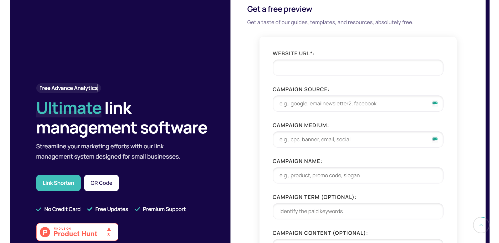

# UTM Link Generator Plugin




## Overview

The UTM Link Generator Plugin by Shotcut.in is a powerful and user-friendly tool designed to help marketers and website owners generate UTM (Urchin Tracking Module) links effortlessly. This plugin simplifies the process of adding UTM parameters to your URLs, allowing you to track your marketing campaigns more effectively.

## Features

- **Easy UTM Parameter Addition**: Quickly add UTM parameters to any URL with just a few clicks.
- **Customizable Parameters**: Customize UTM parameters such as `source`, `medium`, `campaign`, `term`, and `content`.
- **Real-time Link Preview**: See a real-time preview of your generated UTM link.
- **Copy to Clipboard**: Copy the generated UTM link to your clipboard for easy sharing.
- **Responsive Design**: Works seamlessly on both desktop and mobile devices.
- **WordPress Integration**: Use the plugin as a shortcode `[utm_link_generator]` in WordPress.

## Installation

To install the UTM Link Generator Plugin, follow these steps:

### For Standalone Use

1. Clone the repository:
   ```bash
   git clone https://github.com/yourusername/utm-link-generator.git
   ```
2. Navigate to the project directory:
   ```bash
   cd utm-link-generator
   ```
3. Open `index.html` in your web browser to start using the UTM Link Generator Plugin.

### For WordPress

1. Download the plugin files.
2. Compress the files into a `.zip` archive.
3. In your WordPress admin panel, go to `Plugins` > `Add New`.
4. Click `Upload Plugin` and choose the `.zip` file you created.
5. Install and activate the plugin.

## Usage

### Standalone Use

1. Open the UTM Link Generator Plugin in your web browser.
2. Enter the URL you want to generate UTM parameters for.
3. Fill in the desired UTM parameters:
   - **Source**: The source of your traffic (e.g., `google`, `newsletter`).
   - **Medium**: The medium of your traffic (e.g., `cpc`, `email`).
   - **Campaign**: The name of your campaign (e.g., `summer_sale`).
   - **Term**: The keyword term for paid search campaigns (optional).
   - **Content**: Used to differentiate similar content or links (optional).
4. Click the **Generate Link** button to create your UTM link.
5. Copy the generated link to your clipboard using the **Copy Link** button.

### WordPress Shortcode

1. Create or edit a page or post in your WordPress admin panel.
2. Add the shortcode `[utm_link_generator]` where you want the UTM Link Generator to appear.
3. Publish or update the page/post to see the UTM Link Generator in action.

## Attract More Users

By enabling your visitors to generate their own UTM links, you can drive more traffic to your site and engage more users. The UTM Link Generator Plugin not only helps you track your marketing efforts but also provides a valuable tool for your audience. Encourage your users to create and share their own UTM links to enhance their campaigns and increase their engagement with your content.

## License

This project is licensed under the MIT License. See the LICENSE file for details.

## Acknowledgements

- Special thanks to the Shotcut.in team for their support and contributions.

## Contact

For any questions or inquiries, please reach out to us at support@shotcut.in.
